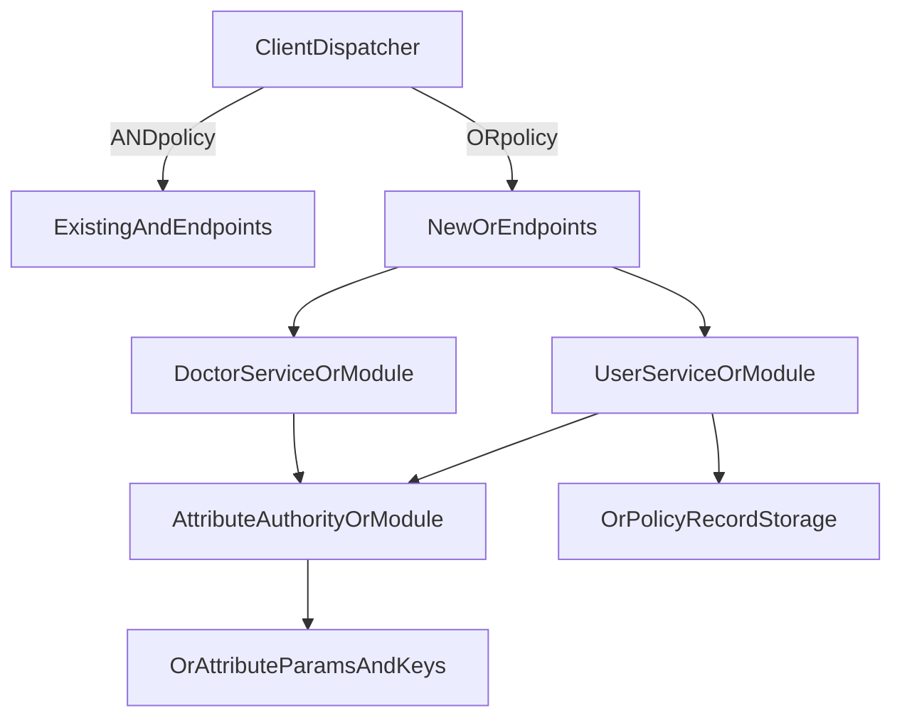

# Add Parallel OR Access Modules

## Goal

Keep the current `AND` access flow untouched and add a parallel `OR` flow inside the same services using separate packages, DTOs, service methods, and endpoints. The app should route to the new flow only when the selected policy is an OR-style access tree.

## Sequential Implementation Plan

1. Define a strict OR-policy contract first.

- Create a shared policy representation for the new flow: root operator, child nodes, leaf attributes, and serialization format.
- Use the `accessTree` field already present in [E:/Desktop/proffesional/code/ABE_In_Healthcare/UserService/src/main/java/com/Suchorit/UserService/model/PatientDetails.java](E:/Desktop/proffesional/code/ABE_In_Healthcare/UserService/src/main/java/com/Suchorit/UserService/model/PatientDetails.java) for the serialized tree, but only for OR-mode records.
- Freeze the first-version policy shape as: full tree structure with OR nodes supported now, and data model compatible with later mixed trees.

1. Add parallel OR packages in the existing services.

- In `UserService`, add packages like `orpolicy`, `orcontroller`, `orservice`, `ormodel`, `orutil`.
- In `Doctor`, add parallel packages for OR decryption/retrieval.
- In `AttributeAuthority`, add parallel packages for OR key generation, tree evaluation, and ciphertext component handling.
- Do not replace or refactor existing `AND` classes such as [E:/Desktop/proffesional/code/ABE_In_Healthcare/UserService/src/main/java/com/Suchorit/UserService/service/UserService.java](E:/Desktop/proffesional/code/ABE_In_Healthcare/UserService/src/main/java/com/Suchorit/UserService/service/UserService.java) or [E:/Desktop/proffesional/code/ABE_In_Healthcare/Doctor/src/main/java/com/Suchorit/Doctor/service/UserService.java](E:/Desktop/proffesional/code/ABE_In_Healthcare/Doctor/src/main/java/com/Suchorit/Doctor/service/UserService.java); only add sibling OR-specific classes and new endpoints.

1. Introduce OR-specific data models and DTOs.

- Add a policy tree DTO: node id, node type (`LEAF` or `GATE`), operator (`OR` for now), threshold metadata, attribute name, children.
- Add ciphertext DTOs for the new algorithm: encrypted payload, per-leaf `Ci` map, root metadata, and any public-key reference needed for reconstruction.
- Add request/response DTOs for:
  - uploading a prescription under OR policy
  - asking AA for OR secret components
  - doctor/staff retrieval under OR policy
- Keep these models separate from the current `allowedRole` / `allowedSpecialization` record contract.

1. Build OR cryptography utilities from `Algorithm.md` in isolated classes.

- In a new OR utility layer, implement:
  - access-tree parsing and validation
  - polynomial assignment for tree nodes
  - leaf ciphertext component generation `Ci`
  - ECC point/scalar handling needed for the session-point reconstruction
  - AES key derivation from reconstructed `Kx`
- Reuse low-level primitives where safe, such as AES-GCM helpers and EC key parsing, but do not alter existing methods used by the AND flow.
- Treat the current ECC/AES code in [E:/Desktop/proffesional/code/ABE_In_Healthcare/Cli/EcKeyUtil.java](E:/Desktop/proffesional/code/ABE_In_Healthcare/Cli/EcKeyUtil.java) and [E:/Desktop/proffesional/code/ABE_In_Healthcare/Cli/AESGCM.java](E:/Desktop/proffesional/code/ABE_In_Healthcare/Cli/AESGCM.java) as reference only; the OR flow should have its own service-side utility classes.

1. Extend Attribute Authority with OR-key-generation modules.

- Add OR-specific AA services that:
  - authenticate the caller as the current system already does
  - fetch the staff/user identity and assigned attributes
  - compute user attribute secret components `Di` for every possessed attribute
  - return an OR-mode key bundle keyed by attribute name
- Keep current `Key` storage for simple role/specialization pairs intact.
- If needed, add a new OR-oriented entity/repository for attribute public parameters and master/public metadata instead of overloading the current [E:/Desktop/proffesional/code/ABE_In_Healthcare/AttributeAuthority/src/main/java/com/Suchorit/AttributeAuthority/model/Key.java](E:/Desktop/proffesional/code/ABE_In_Healthcare/AttributeAuthority/src/main/java/com/Suchorit/AttributeAuthority/model/Key.java).

1. Add OR upload endpoints in `UserService`.

- Create a new upload endpoint dedicated to OR flow, for example `/user/or/upload` or an OR controller equivalent.
- That endpoint should:
  - accept the serialized access tree
  - validate OR-mode policy syntax
  - encrypt the file using the OR algorithm
  - store `accessTree`, `cipherKey`, and encrypted payload fields
- Leave the existing `/user/upload` behavior unchanged so the old CLI and clients keep working.

1. Add OR retrieval endpoints for patient self-access.

- Create OR-specific endpoints for:
  - listing OR-protected records
  - fetching one OR-protected prescription
  - obtaining OR-mode decryption material from AA
- For patient self-access, use the OR tree metadata and the patient’s assigned/derived attributes to reconstruct the secret instead of the old `role/spec` unwrap flow in [E:/Desktop/proffesional/code/ABE_In_Healthcare/UserService/src/main/java/com/Suchorit/UserService/service/UserService.java](E:/Desktop/proffesional/code/ABE_In_Healthcare/UserService/src/main/java/com/Suchorit/UserService/service/UserService.java).

1. Add OR retrieval endpoints in `Doctor`.

- Create OR-specific controller/service methods for fetching OR-protected records available to a staff member.
- At retrieval time, the OR service should:
  - fetch the ciphertext bundle and serialized tree
  - obtain the staff attribute key map from AA OR endpoints
  - recursively evaluate the tree
  - reconstruct the ECC-derived AES key when at least one valid OR branch satisfies the policy
- Keep the existing hospital-view and profession-view methods unchanged for old records.

1. Add runtime switching at the application boundary.

- Add a simple dispatch rule in the new controllers/CLI integration layer: if the selected policy contains OR/tree-mode metadata, call the OR endpoints; otherwise keep using the current AND endpoints.
- Avoid mixing both algorithms inside the same service method; use a dispatcher/facade that delegates to either `And*` or `Or*` services.

1. Add persistence separation and backward-compatible queries.

- Either store OR records in the same `PatientDetails` table using `accessTree`/`cipherKey` plus a mode flag, or add a parallel OR entity/table if you want stronger isolation.
- Recommended: add a mode discriminator such as `policyMode = AND | OR` in a new OR-specific entity or DTO layer, and keep old queries untouched.
- Existing list/query methods like the current profession filters should ignore OR-only records unless explicitly requested through OR endpoints.

1. Add focused tests for the new path only.

- Unit tests:
  - tree parser/validator
  - OR-node evaluation
  - ciphertext component generation and reconstruction
  - attribute-key matching
- Integration tests:
  - upload with OR tree
  - doctor with one matching attribute can decrypt
  - doctor with no matching attribute cannot decrypt
  - old AND upload/decrypt flow still works unchanged

1. Roll out in this order.

- First: policy DTOs and OR utility layer
- Second: AA OR key services and repositories
- Third: `UserService` OR upload/retrieval endpoints
- Fourth: `Doctor` OR retrieval/decryption endpoints
- Fifth: CLI or caller-side dispatch that switches to OR methods when OR policies are chosen
- Sixth: regression tests for both paths

## Recommended Architecture

## Files To Treat As Stable Boundaries

- Keep old flow behavior stable in [E:/Desktop/proffesional/code/ABE_In_Healthcare/UserService/src/main/java/com/Suchorit/UserService/service/UserService.java](E:/Desktop/proffesional/code/ABE_In_Healthcare/UserService/src/main/java/com/Suchorit/UserService/service/UserService.java)
- Keep old doctor decryption flow stable in [E:/Desktop/proffesional/code/ABE_In_Healthcare/Doctor/src/main/java/com/Suchorit/Doctor/service/UserService.java](E:/Desktop/proffesional/code/ABE_In_Healthcare/Doctor/src/main/java/com/Suchorit/Doctor/service/UserService.java)
- Keep the current keypair entity stable for the AND path in [E:/Desktop/proffesional/code/ABE_In_Healthcare/AttributeAuthority/src/main/java/com/Suchorit/AttributeAuthority/model/Key.java](E:/Desktop/proffesional/code/ABE_In_Healthcare/AttributeAuthority/src/main/java/com/Suchorit/AttributeAuthority/model/Key.java)
- Reuse `PatientDetails.accessTree` and `PatientDetails.cipherKey` only as storage fields for the OR path unless you later split OR data into a dedicated entity

## Design Guardrails

- No behavioral changes to current endpoints used by the AND flow.
- No in-place replacement of role/specialization encryption logic.
- All OR logic must be reachable through new controllers/services only.
- Keep the first OR implementation tree-compatible so later `AND + OR` mixed trees can be added without redesigning storage and DTOs.
